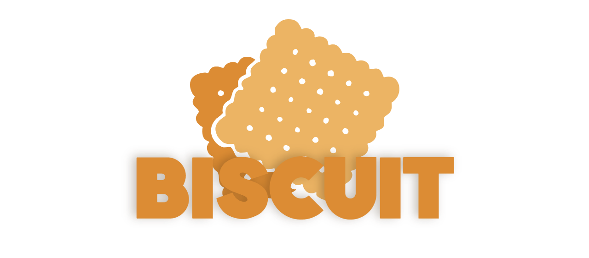

<h2 align="center">
    <br>
    The uncompromising code editor<br><br>
     
     
    <a href=https://github.com/billyeatcookies/Biscuit/releases> 
         
    </a>
    
</h2>

🚀<b>A</b> magnificent project that brings together the best elements of eminent code editors while adding its own unique flair. Compact, yet compelling; comprehensive, yet concise – Biscuit has set its sights on conquering the realm of code editing, capturing the hearts of developers and enthusiasts alike. Biscuit is here to reshape your coding universe!
<br><br>
❤ <b>Our</b> project aims to foster a vibrant open-source community of Python enthusiasts, working together to create a truly innovative tool. With invaluable contributions from passionate collaborators, Biscuit has made significant progress in incorporating essential features such as syntax highlighting, autocompletion, and Git integration.

<h1></h1>
<h3>
    
</h3>

## 💿 Installing Biscuit 
[](https://github.com/billyeatcookies/Biscuit/releases)

You can download the latest compiled pre-release of Biscuit for Windows and Linux from [Releases](https://github.com/billyeatcookies/Biscuit/releases)!

### 🛠 Building from Source
The project is a WIP. Bugs and missing or incomplete features will be present in the current unreleased version.
> **Note**
> You need **python 3.10** or above.

Download the project source or clone this repo, in the project directory run:
```bash
> pip install -r requirements.txt
> python -m biscuit
```
To run in a separate virtual environment, you can use [python poetry](https://python-poetry.org/).
To compile Biscuit for your platform, see [compiling guide](https://github.com/billyeatcookies/Biscuit/tree/main/scripts).

> **Note**
> If you are getting an error during installation in **Linux**, install following dependencies and try again:
> ```bash
> > sudo apt install fontconfig libfontconfig1 libfontconfig1-dev cmake cmake-data extra-cmake-modules build-essential
> > pip install scikit-build
> ```


## ❤ Contributors 
To contribute to the biscuit project, check our [contributing guidelines](./CONTRIBUTING.md). Your contributions and support are greatly appreciated! 🧡 

<a href="https://github.com/billyeatcookies/biscuit/graphs/contributors">
  
</a>

## 📸 Screenshots 


## ✨ Features
- **Palette** which works based on various prompts used 
  (`Ctrl` + `shift` + `p` for command palette)


- **Autocompletions** & **Syntax Highlighting** (based on word matching and regex, no language server)


- **PathView** for the **Breadcrumbs!**


