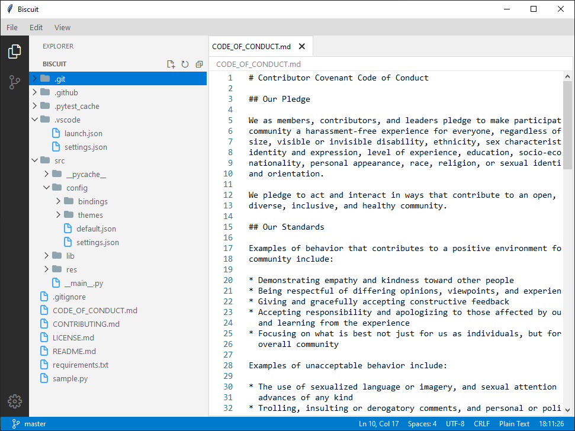

<h1 align="center">
    <b>Biscuit</b> - Code Editor
</h1>

<h3 align="center">
    
  
  
   
  
  
  

  
</h3>

    

## About
Biscuit is a highly customizable code editor written completely in pure python with the tkinter library. Biscuit stands lightweight, fast and powerful among other code editors. It is easy to use and feature rich.

## Code Editing Features
Biscuit is powered by the [**Cupcake**](https://github.com/billyeatcookies/cupcake) code editor, written in pure python with the tkinter library. Features provided by cupcake include syntax highlighting, code completion, language specific tools, minimap, etc.

## Usage

### Prerequisites

- python
- pip packages
    > Install with `pip install -r requirements.txt`

### Running

- Run `cd src`
- Run `python .`
- Open a directory or file on biscuit.
- Start editing!

## Biscuit Developer Guide
I would love to welcome your contributions to biscuit! Please see the [Developer Guide](./CONTRIBUTING.md) if you are having any issues :)
