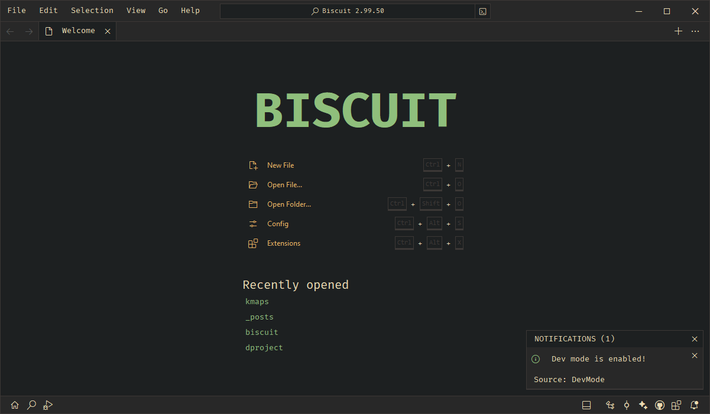

# Quick Start

This guide will help you set up Biscuit in 5 minutes. 

## Installation

Recommended way to install Biscuit is via pip:

```bash
pip install biscuit-editor
```

Try running `biscuit --version` in your terminal to check if the installation was successful.

See the [installation guide](installation.md) for more detailed instructions on installing Biscuit.

## Starting Biscuit

Next, you can start using Biscuit by simply running:

```bash
biscuit
```

You can also open a directory/file directly by running:

```bash
biscuit path/to/folder
```

This will open the specified directory/file in Biscuit.
For more options, run `biscuit --help` or check the [CLI reference](../cli.md).

## User Interface

Biscuit's user interface is designed to be minimalistic and more focused on the content. When you open Biscuit you'll see a **welcome tab** with quick access to common actions. At the bottom, you'll find the status bar which also has buttons to show/hide the sidebar views and terminal. Buttons on the left and right will toggle the sidebars of corresponding sides. 



To view all commands available in Biscuit, press `Ctrl+Shift+P` or the command palette button from titlebar. This will open the command palette where you can search for commands. The titlebar contains a simple menu bar and a search bar which can be used to search for files in the opened workspace.

### Terminals

Biscuit can have multiple integrated terminals running in the editor. You can open a terminal by clicking on the panel toggle on the status bar or by pressing Ctrl+`. To open more terminals, click on the plus icon and pick from the options (depending on the OS cmd, bash, powershell, etc. will be available).

### Extensions
To Browse extensions click on **Extensions** from welcome tab or the extensions button on the status bar. You can install recommended extensions and access them instantly as they are installed. 

### Git
Biscuit has built-in Git support, so you can manage your Git repositories directly from the editor. Click on the Source Control icon on the status bar to open the Git view.

## Next Steps

- [Configure Biscuit](configuration.md)